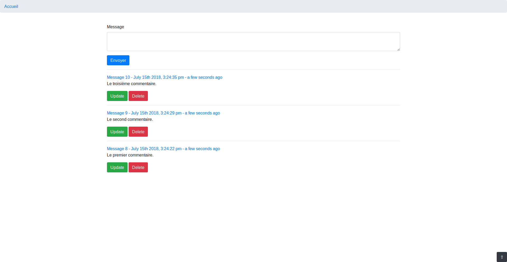

# Guestbook

## Install

`npm install && npm run install`

## Documentation

* <https://babeljs.io/docs/en/babel-cli>
* <https://github.com/jakubpawlowicz/clean-css-cli>
* <https://date-fns.org/>
* <https://expressjs.com/en/4x/api.html>
* <https://github.com/visionmedia/debug>
* <http://ejs.co/#docs>
* <https://github.com/SBoudrias/Inquirer.js>
* <https://knexjs.org/>
* <https://github.com/mysqljs/mysql>
